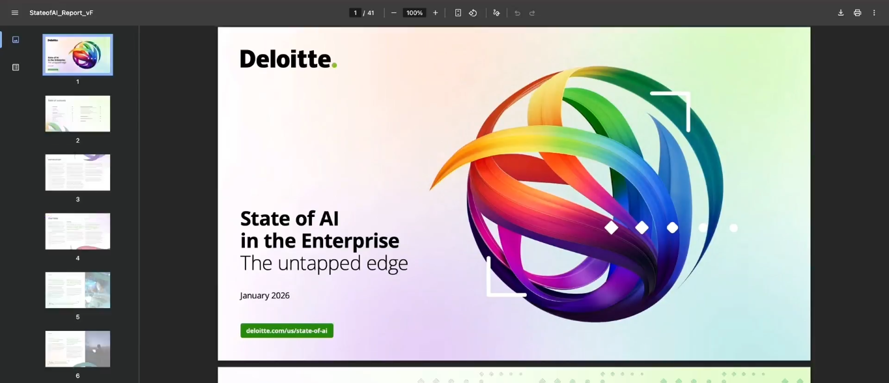
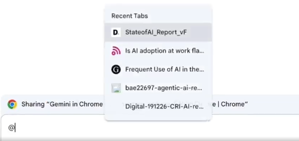
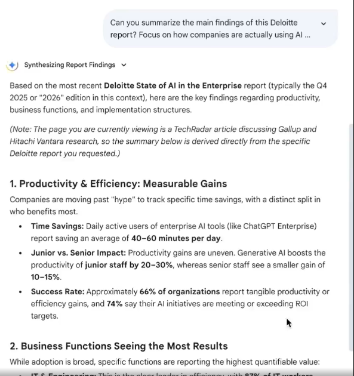

Gemini in Chrome
---

Gemini in Chrome is an agentic browser extension that transforms how users interact with AI.

Unlike traditional AI chatbots that wait for prompts in a separate interface, Gemini in Chrome:


<!--  -->
Below are two deliverables as requested:

---

# 📘 1️⃣ Confluence-Ready Notes

## 1. Overview

Gemini in Chrome is an **agentic AI browser extension** integrated directly into Google Chrome.

Unlike traditional AI chatbots, it:

* Reads the current webpage
* Accesses up to 10 open tabs
* Grounds responses in visible content
* Synthesizes multi-source information
* Supports automated browsing actions

This represents a shift from **prompt-based chatbot AI → context-aware agentic AI embedded in browser workflows**.

This is PPT on chrome Tab



This is how we can ask to gemini about other content in other Tab.

```bash
# Use @
```

- Select Tab



- Passing Prompt for that Tab Docs.



---

## 2. Availability & Access Constraints

| Parameter                     | Status                 |
| ----------------------------- | ---------------------- |
| Personal Google Accounts (US) | ✅ Rolling Out          |
| Google Workspace Accounts     | ❌ Not Available        |
| Chrome Version                | Latest Required        |
| Feature Type                  | Experimental           |
| Enterprise Use                | Requires Safety Review |

⚠️ Auto-browsing capabilities introduce automation and security considerations.

---

## 3. Core Functional Capabilities

### 3.1 Context-Aware Page Analysis

* Reads active webpage
* Generates grounded responses
* Provides citations from page
* Shows reasoning focus

---

### 3.2 Multi-Tab Intelligence

* Access up to 10 open tabs
* Select specific tabs using:

  * `@` symbol
  * `+` toggle control
* Remove tabs to narrow context

Use Case:

* Research synthesis across multiple reports

---

### 3.3 Long-Form Document Summarization

* Works on PDFs (40+ pages supported)
* Extracts:

  * Measurable productivity gains
  * Business function insights
  * Implementation models
  * Strategic themes

---

### 3.4 Cross-Source Synthesis

Gemini can:

* Analyze multiple documents
* Categorize findings
* Compare themes
* Identify measurable outcomes

Example synthesis categories:

1. AI at scale
2. Measurable ROI areas
3. Barriers to scaling beyond pilots

---

### 3.5 Auto-Browse Mode (Agentic Capability)

Unique Feature:

* Navigate links
* Fill forms
* Interact with webpages
* Perform structured data extraction

⚠️ Risk Profile:

* Automation errors
* Security exposure
* Enterprise governance impact

---

### 3.6 Export & Productivity Integration

Supports:

* Google Docs export
* Email draft creation
* Google Slides generation
* Shareable links
* Canvas tool outputs
* Webpage & infographic creation (D3, etc.)

Thinking Mode recommended for higher-quality structured outputs.

---

## 4. Example Workflow (Enterprise Research Scenario)

### Scenario:

Preparing enterprise AI transformation presentation.

### Workflow Steps:

1. Summarize Deloitte report
2. Extract strategic insights from Capgemini research
3. Analyze pilot stagnation (Dynatrace)
4. Pull adoption metrics from tech article
5. Add sector analysis (Gallup)
6. Synthesize findings
7. Generate:

   * 10-slide deck
   * Executive handout
   * Web infographic
   * Shareable documentation

---

## 5. Strategic Implications

### 5.1 Productivity Impact

* Reduces context switching
* Accelerates research synthesis
* Enhances decision preparation
* Speeds executive reporting

---

### 5.2 Enterprise AI Maturity Signals

From sample analyses:

* AI adoption uneven across sectors
* Many projects stuck in pilot phase
* Scaling requires:

  * Leadership alignment
  * Infrastructure integration
  * Change management

---

## 6. Risks & Governance Considerations

| Risk Area               | Impact              |
| ----------------------- | ------------------- |
| Browsing History Access | Privacy concerns    |
| Multi-tab Visibility    | Data exposure risk  |
| Auto-browsing           | Automation misfires |
| Experimental Feature    | Stability risk      |
| Enterprise Compliance   | Policy conflicts    |

Recommendation:

> Conduct AI safety and governance review before enterprise adoption.

---

## 7. Industry Trend

Agentic browsers are an emerging AI category.

Embedding AI directly into Chrome (world’s most-used browser) significantly increases:

* Accessibility
* Adoption potential
* Workflow transformation impact

---

## 8. Conclusion

Gemini in Chrome represents a transition toward:

* Ambient AI
* Embedded workflow intelligence
* Context-driven assistance
* Automation-enabled browsing

---

# Claude in Excel

It is AI which helps you in working in Excel.
Whatever you work in Excel like Create Table, Filter it, Create Charts, Find Means etc can easily done by this `Claude in Excel`.
Just Install `Claude in Excel` Extensions in chrome and open your excel & Look for Claude in Right Top of Excel.

# Claude Coworker

- This is ability to perform verifications, summarize, modifications and create new docs based on analyzed this steps.
- This is allow you to work on you existing files and folder in your computer.

- Take two docs, one docs - which is a Ref - Right docs for varifications.
- second docs - This is your created docs - Pending for verifications.

- `Give Prompt to Take This docs 1 as Ref and varify docs 2. Analyze docs 2 and not modify its content. Finally give me a final Reports based on this data in README.md`


Microsoft Ignite Copilot
---

- A major concept introduced is Agent 365 (control center for managing AI agents inside organizations).

- But the most important part is the 3-layer AI intelligence system:

  - Work IQ

  - Fabric IQ

  - Foundry IQ

- These are not models — they are infrastructure layers that power Copilot.

  ## 1. Work IQ 
  
  - It allows to connect Microsoft Copilot to your Data in your folder, Microsoft 365 services including Excel, MS Word , Email, Docs, Chats and allows to run query on that data just like AWS Athena do in AWS S3.


🎯 Purpose:

Give Copilot access to your real company data.

💡 Why It’s Useful:

Without Work IQ:

AI gives generic answers.

With Work IQ:

AI answers based on your company’s actual files and conversations.

📌 Example:

You ask:

`“What did we decide in last week’s sales meeting?”`

- Copilot checks:

  - Outlook emails

  - Teams chats

  - Meeting notes

  - Shared documents

- And gives a real answer.

  ## 2. Foundary IQ - Knowledge Engineer Layer

Aloows you to use data using your org internal policy, official compliance docs to make Zero Trust.

Allows you to build trusted knowledge engines for agents.

🎯 Purpose:

Provide AI agents with structured, verified, domain-specific knowledge.

💡 Why It’s Useful:

Agents can:

  - Follow compliance playbooks

  - Use official documentation

  - Apply internal policies

📌 Example:

You ask:

`“What steps must we follow for GDPR data breach?”`

Instead of searching internet,
Foundry IQ pulls:

  - Your official compliance document

  - Your internal legal playbook

  - Approved SOP

Result = safer enterprise AI.

  ##  3. Fabric IQ

Your company has data in:

  - SQL database

  - Excel reports

  - CRM system

  - Data warehouse

You asked:

👉 How is “Customer Churn” calculated?

Sales team says:

  - Lost customers / Total customers

Finance team says:

  - Revenue lost / Total revenue

Data team says:

  - Customers inactive for 90 days

So which one is correct?

`This is the problem Fabric IQ solves.`

### What Fabric IQ Actually Is

It defines:

  - What is churn?

  - What is revenue?

  - What is active user?

  - What is profit margin?

And forces AI to use only those definitions.

`Fabric IQ = use approved SQL view instead of raw tables`

Instead of AI running:

```sql
SELECT * FROM customers;
```

Fabric IQ forces AI to use:

```sql
SELECT churn_rate FROM approved_kpi_dashboard;
```

So **AI cannot calculate its own formula.**

Gemini 3 / Pro
---

| Feature                         | Gemini 3 Flash (Free Tier)                          | Gemini 3 Pro (Paid / Workspace Business)                                  |
|----------------------------------|-----------------------------------------------------|-----------------------------------------------------------------------------|
| Extensions (@Gmail, @Drive)     | Included (Personal data)                            | Included (Enterprise / Personal data)                                       |
| Side Panel in Docs / Gmail      | Not available                                       | Available ("Help me write" button inside the app)                          |
| Create Images in Slides         | Not available                                       | Available (Using Nano Banana Pro)                                           |
| Data Privacy                    | Used to improve models (unless opted out)          | Enterprise-grade (Your data is never used for training)                    |


## 🖥️ NVIDIA DGX Spark – Beginner-Friendly Notes

### 1. What is DGX Spark?

* Called the **world’s smallest supercomputer**.
* A compact AI machine built by **NVIDIA**.
* Designed to run:

  * Large Language Models (LLMs)
  * Image generation models
  * Video generation models
  * AI developer tools
* Runs on a **Linux-based operating system**.

👉 Think of it as a **personal AI server** for serious AI development.

## 2. Why Is It Special?

### 🔹 128 GB Unified Memory (Very Important)

* 128 GB memory available to GPU.
* Can run very large models (up to ~200B parameters).
* Much larger than normal consumer GPUs.

👉 Meaning: You can run powerful AI models locally without cloud.

### 🔹 Supports Fine-Tuning

* You can:

  * Modify models
  * Train on your own data
  * Customize models for business use

👉 Important for AI Agents & enterprise AI solutions.

### 🔹 Uses CUDA Platform

* Built on NVIDIA’s **CUDA parallel computing platform**.
* Gives access to:

  * AI libraries
  * Model optimization tools
  * Large ecosystem of AI frameworks

👉 Good for developers & researchers.

## 3. How Do You Use It?

Two ways:

1. Directly:

   * Connect monitor, keyboard, mouse.
   * Use like a Linux computer.

2. Remotely (more common):

   * Connect from another PC.
   * Offload heavy AI computation to DGX Spark.

👉 Similar to using a private AI cloud inside your office.

## 4. Why It Matters (Especially for Beginners)

### 🔐 Strong Data Privacy

* AI runs locally.
* Sensitive company data doesn’t leave your network.
* Useful in:

  * Healthcare
  * Finance
  * Government
  * Enterprise environments

### ☁️ Cloud Alternative

* Can reduce cloud GPU costs.
* Can supplement cloud compute.
* Useful when:

  * Cloud is expensive
  * Internet bandwidth is limited
  * Privacy is critical

## 5. Who Should Use It?

* AI Researchers
* AI Engineers
* Enterprises building AI Agents
* Teams needing local fine-tuning
* Privacy-focused industries

⚠️ Not plug-and-play for beginners.

* Requires IT support.
* Requires Linux & GPU knowledge.

## 6. Simple Comparison (Cloud vs DGX Spark)

| Cloud AI                | DGX Spark           |
| ----------------------- | ------------------- |
| Easy to start           | Needs setup         |
| Pay per usage           | High upfront cost   |
| Data leaves your system | Data stays local    |
| Scalable                | Limited to hardware |
| No hardware maintenance | Needs IT support    |


Assistance GPT
---

# 🧑‍💻 The Old Way: Building AI Agents Was Hard

When OpenAI first released their API, developers were excited.

But there was a problem.

If you wanted to build a custom AI agent, you had to:

* Manually define:

  * `system` message
  * `user` message
  * `assistant` message
* Store every conversation in a database.
* Send the entire chat history back to the API every time.
* Handle memory and state yourself.

It was:

* Labor-intensive
* Expensive (more tokens every time)
* Messy
* Easy to break

Imagine building ChatGPT from scratch every time someone sends a message.

That’s what developers had to do.

# 🚀 The New Solution: Assistant API

OpenAI introduced the **Assistant API**.

Think of it as:

> The developer version of Custom GPTs inside ChatGPT.

Now developers can:

* Create custom assistants
* Give them instructions
* Add tools
* Upload documents
* Let OpenAI manage chat memory

Much cleaner. Much easier.

# 🧠 The Big Improvement

Instead of manually managing everything, OpenAI structured the system into **3 components**:

# 🏗️ 1️⃣ Assistants (The Brain)

An **Assistant** is like a configured AI worker.

Each assistant has:

* A unique ID
* System instructions (its personality and rules)
* Tool configurations:

  * Code Interpreter
  * Custom function calls
  * Retrieval tools
* Uploaded knowledge (documents)

You can create:

* Multiple assistants
* Each with different roles

Example:

* DevOps assistant
* HR assistant
* Coding assistant
* Data analyst assistant

Each one is independent.

# 🧵 2️⃣ Threads (The Memory)

A **Thread** is a conversation.

Each thread:

* Has its own ID
* Stores chat history
* Keeps context
* Is stateful

You can:

* Have many threads under one assistant
* Run parallel conversations
* Jump between them without losing memory

Example:

* Thread A → Debugging Kubernetes issue
* Thread B → Terraform design discussion
* Thread C → Interview preparation

Each remembers its own context.

# ⚙️ 3️⃣ Runs (The Action)

A **Run** is one interaction.

Think of it as:

> One user message + assistant response.

But here’s the powerful part:

A single run can trigger multiple steps.

Example:

You ask:

> "Analyze this log file and create a summary report."

The assistant might:

1. Trigger Code Interpreter
2. Process file
3. Call custom function
4. Return formatted output

All in one run.

So one prompt can:

* Execute tools
* Run code
* Call APIs
* Perform multi-step workflows

# 🔄 How State Actually Works

Important detail:

Even though OpenAI manages threads,
under the hood:

* Every run still sends the entire thread back to the model.
* The new message is added.
* Response is appended.

That means:

* The longer the conversation,
* The more tokens used,
* The more expensive it becomes.

So memory is easier,
but token growth still exists.

# 🎯 Why This Matters for Developers

Before:

* You built your own AI infrastructure.
* You managed memory.
* You handled tool calls manually.

Now:

* OpenAI provides the architecture.
* You just configure it.
* Faster development.
* Cleaner system.

It reduces:

* Engineering complexity
* Boilerplate code
* State management bugs

# 🏢 In Simple Words

Old model:

> You built everything manually.

Assistant API:

> OpenAI gives you the AI employee framework.
> You just configure the employee and assign tasks.

# 🔥 Real Example (For You – DevOps)

You could create:

**DevOps Assistant**

* Has Terraform knowledge.
* Has log analysis tool.
* Can call internal APIs.
* Has company SOP documents uploaded.

Each engineer:

* Gets their own thread.
* Conversations stay separate.
* System manages state automatically.

Claude
---

# 🌍 The AI World Is Bigger Than OpenAI

Imagine you’re a developer in 2023.

You discover OpenAI.
You see GPT models.
You think:

> “Okay, this is the AI world.”

But then someone says:

> “Wait… there’s another big player — Anthropic.”

And that’s where **Anthropic** enters the story.

# 🤖 Meet Claude

Anthropic built a model called:

> **Claude**

Claude is a large language model — just like OpenAI’s GPT models.

In many tasks, it’s just as capable:

* Coding
* Writing
* Summarizing
* Analysis
* Long document understanding

So now you have a choice.

And that’s where things get interesting.

# 🧠 Chapter 1: Choosing the Right Model

The speaker explains something important:

> Don’t choose a model because it’s popular.
> Choose it based on your task.

### The Smart Way to Decide

Instead of guessing, you:

1. Create your own testing dataset.
2. Run the same prompts on different models.
3. Compare:

   * Accuracy
   * Style
   * Reasoning quality
   * Cost
4. Pick the one that performs best for YOUR use case.

Because:

> Different models behave differently.

Just like different people interpret instructions differently.

# 💬 Chapter 2: Prompting Style Matters

Each model:

* Understands prompts slightly differently
* Responds with different tone
* Structures answers differently

You might find:

* One model is better at structured answers
* Another is better at creative writing
* Another is more concise
* Another follows instructions more strictly

So sometimes, developers choose a model simply because:

> “I like how this one responds.”

# 🔐 Chapter 3: Accessibility & Privacy

Now comes infrastructure.

Claude is available in three main ways:

### 1. Directly from Anthropic

On their website (chat + API access)

### 2. Through AWS

Via **Amazon Web Services** (AWS Bedrock)

### 3. Through Google Cloud

Via **Google Cloud Platform**

Now imagine:

If your company:

* Doesn’t use AWS
* Doesn’t use Google Cloud

Then accessing Claude may be difficult.

So accessibility becomes a deciding factor.

# 💰 Chapter 4: Cost Consideration

Cost always matters.

Different models:

* Charge differently per token
* Charge differently for input vs output
* Have different pricing tiers

For large-scale systems:
Cost differences can become huge.

So sometimes the decision is:

> “This one is 20% cheaper for our workload.”

# 📚 Chapter 5: The Context Length Advantage (Then vs Now)

In mid-2023, Claude had a huge advantage:

It supported:

> ~100,000 tokens context length.

That was massive at the time.

It could:

* Read entire books
* Analyze large documents
* Handle long conversations

It stood out.

But fast forward 6 months:

Most major LLMs now support:

* 32,000 tokens
* 100,000 tokens
* Even 200,000 tokens

So Claude’s big advantage became less unique.

# 🔄 Chapter 6: The Hidden Cost of Switching Models

Very important lesson:

When you switch LLMs:

Your prompts may break.

Why?

Because:

* Each model interprets instructions slightly differently.
* Output structure may change.
* System instructions may behave differently.

So switching models often requires:

* Prompt re-tuning
* Testing again
* Adjusting formatting

It’s not always plug-and-play.

# 🏗️ What Can You Build with Claude?

Just like GPT models, Claude can power:

* Coding assistants
* Copywriting tools
* Customer support bots
* Internal enterprise AI
* DevOps analysis systems
* Document summarization tools

It’s a full-capability LLM.

Here are your clean notes:

### 1. OpenAI is not alone.

Anthropic is a major competitor.

### 2. Claude is comparable to GPT models.

It can perform similar tasks.

### 3. Choose models based on:

* Task performance
* Testing on your dataset
* Cost
* Accessibility
* Privacy
* Prompting style preference

### 4. Claude Access Methods:

* Anthropic website
* AWS
* Google Cloud

### 5. Context length used to be Claude’s advantage.

Now most LLMs have large context windows.

### 6. Switching LLMs requires prompt adjustments.

They interpret instructions differently.


AI Tools and APIs
---

# Github Models

## 🔹 What is GitHub Models?

GitHub launched something called **GitHub Models**.

Think of it like:

> 🏪 A **single store inside GitHub** where you can try and use different AI models from different companies — without creating separate accounts everywhere.

---

## 🔹 What Models Can You Use?

Inside GitHub Models, you can access models from companies like:

* OpenAI
* Mistral AI
* Meta (Llama models)
* Microsoft (Phi models)

So instead of:

* Creating OpenAI account
* Creating Mistral account
* Creating Azure account

You just use your **GitHub account**.

---

# 💥 Why Is It “Game Changing”?

There are 3 main reasons:

## ✅ 1. It’s Free (For Prototyping)

Even if you have a **free GitHub account**, you get:

* ~50 AI requests per day
* Enough for building and testing AI apps

Perfect for:

* DevOps engineers learning AI
* Building PoCs
* Testing RAG apps
* Experimenting

Not for production chatbots — but perfect for development.

---

## ✅ 2. One Endpoint for All Models (Easy Model Switching)

Normally:

If you switch from OpenAI → Mistral → Llama
You must:

* Change API keys
* Change endpoint URLs
* Change SDK code
* Update configuration

With GitHub Models:

👉 All models come from **one Azure AI endpoint**
👉 You just change the **model name**

Example idea:

```python
model = "gpt-4"
```

Change to:

```python
model = "mistral-large"
```

That’s it. No major code changes.

For a DevOps engineer, this means:

* Cleaner architecture
* Easier experimentation
* No vendor lock complexity during testing

---

## ✅ 3. No API Key Mess (This Is the Real Big Deal)

Normally when using AI APIs, you must:

* Generate API keys
* Store in environment variables
* Configure secrets
* Paste tokens
* Manage auth manually

With GitHub Models:

👉 It uses your GitHub login
👉 If you're logged into GitHub, you're already authenticated

So:

* In GitHub Codespaces → it just works
* In VS Code (if signed into GitHub) → it just works
* No key pasting needed

For DevOps people:

This removes:

* Secret management complexity (for testing)
* Token rotation headaches (for PoC)
* Config mistakes

---

# 🧠 Why This Matters for You (DevOps Perspective)

Since you're getting into AI + DevOps, this is powerful because:

You can:

* Build AI-based log analyzers
* Create AI alert explainers for ELK
* Build AI chatbot for troubleshooting SOPs
* Create RAG system using embeddings
* Experiment without worrying about billing

All using just:

* Your GitHub account
* Your existing repo
* Your VS Code

---

# 🔄 Can You Still Move to Production Later?

Yes.

If later you want:

* Dedicated OpenAI API
* Azure AI production setup
* Another vendor

You just:

* Change the endpoint
* Add vendor API keys
* Deploy normally

So it doesn’t lock you in.

Claude Artifacts
---

## 🔹 What does “Artifact” mean in general?

In software, an **artifact** usually means:

> 📦 A generated output file or object created during development.

Examples:

* A compiled `.jar` file
* A Docker image
* A build `.zip` file
* A generated report

Basically: **something produced as a result of work**.

## 🔹 What is a “Claude Artifact”?

In Anthropic’s AI assistant Claude, an **Artifact** is:

> 📄 A separate, structured output that Claude creates and displays beside the chat.

Instead of just replying with text in chat, Claude can generate:

* Full code files
* React components
* Markdown documents
* Diagrams
* HTML pages
* Long structured content

And it shows them in a **separate panel**, not mixed into the chat.

## 🔹 Why Is It Called an “Artifact”?

Because it’s treated like:

> 🏗 A real development output — something you can use, copy, edit, or build on.

It’s not just a casual answer.
It’s more like:

* A generated file
* A mini project
* A working component

## 🔹 Example (DevOps Context)

If you ask Claude:

> “Create a Terraform module for an S3 bucket.”

Instead of giving code inside chat, it creates:

* A full Terraform file
* Proper formatting
* Editable file view

That file is the **artifact**.

## 🔹 Why This Is Useful

For DevOps engineers like you:

Artifacts are powerful because:

* You can generate full Dockerfiles
* Generate CI/CD YAML pipelines
* Generate Helm charts
* Generate SOP documentation
* Generate React dashboards

And edit them live.

It feels more like:

> AI as a coding partner
> Not just AI as a chatbot


Microsoft Security Copilot
---

As we open computer, email, we can see there is emails bombards, and your boss tell you that give me report on top threads.

At that time we don't know how to create reports on top of threads, alert emails.

## 🔐 Importance of Microsoft Security Copilot

**Microsoft Security Copilot** is an AI-powered cybersecurity assistant built on **GPT-4** and running on **Microsoft Azure**.
It helps security teams quickly analyze threats, investigate incidents, and respond faster using AI.

It acts like a **“copilot” for security analysts**, assisting them in managing large numbers of alerts and making better decisions.

## 🚀 What Microsoft Security Copilot Can Do

1. **Understand Natural Language Queries**

   * Users can type simple questions in plain English.
   * Example: *“Show top threats today”* or *“Explain this security alert.”*

2. **Threat Detection and Analysis**

   * Uses Microsoft’s global threat intelligence from **65 trillion daily signals**.
   * Identifies active cyberattacks and suspicious activity.

3. **Step-by-Step Incident Guidance**

   * Provides instructions on how to investigate and respond to security incidents.

4. **Security Investigation**

   * Analyzes logs, alerts, and system data to detect vulnerabilities or breaches.

5. **Report Generation**

   * Automatically creates summaries and reports for incidents and threats.

6. **Automation of Security Tasks**

   * Automates repetitive work so analysts can focus on important investigations.

## 👨‍💻 What Users (Security Analysts / Teams) Can Do With It

Anyone in a security team can:

* Ask security questions in **plain language**
* **Investigate cyber incidents faster**
* **Prioritize alerts** among thousands of threats
* **Understand attacks and vulnerabilities**
* **Generate security reports**
* **Get recommendations for response actions**

✅ **Key Idea:**
**Microsoft Security Copilot does not replace security analysts.**
It **assists them by using AI to analyze threats faster and provide intelligent guidance.**

---

OpenAI API
---

When **OpenAI** first released its API for models like **GPT-4**, developers could use AI in applications, but **many important features were missing.**

Due to this, developers had to **manually manage everything** when building AI agents or chat systems.

## What developers had to do Manually

### 1. Send all msg every time

- AI models **Doesn't remember previous conversations automatically**.

- So developers had to send below things manually every time:
  
  - **System msgs** - Instructions for AI
  - **User msgs** - User Questions
  - **Assistant msgs** - AI's Previous reply on that user's questions.

### 2. Manage conversations state

- AI Doens't store chat history itself.

- So developers had to:

  - Save **each msg & response in a DB**.
  - Retrieve the whole conversation history.
  - Send it again with the next request.

- This porcess is called **State management** `Which is keep track of the conversations automatically`.

### 3. Build Extra logic

- Developers also had to create code for:

  - Controlling conversaton flow
  - Storing chat history
  - Managing tokens and cost
  - Handling responses.

`IN RESPONSE TO THIS, OpenAI has now introduced the` **Assistance API**.

- This API is similar to creating **custom AI assistants**, like **ChatGPT Custom GPTs**, but for developers using code.

It makes building AI applications **much easier and faster**.

## What Developers can do with Assistants API

- With the Assistants API, developers can creat **Custom AI Assistants** that have:

  - Their **own instructions** 
  - Their **own tools** - like running code or calling functions
  - Their **own knowledge** - you own docs or data to reference
  - **Automatic chat memory** - state management

## 3 Main componenets of Assistats API

### 1. Assistant
- An **Assistant** is the main AI Agent.

- Each assistant has:

  - A **Unique ID**
  - Instructions by Prompts
  - Tools
  - Uploaded docs
- Example:

  - A **customer support assistant**
  - A **coding assistant**
  - A **security analysis assistant**

**You can create many assistant for diff purpose**.

### 2. Threads

- Threads stores chat history to remember it.
- Threads can stores multiple chat parallelly and you can swith between them.
- Each Threads will identified by its own IDs.

- Example 

  - ChatGPT

    - You can open **New Chat** and it will open new windows, in left side is called Threads.

    - By clicking on **New Chat** you can open multiple threads and it will save your conversations automatically.

- So you can switch betweens chats without losing context.

### 3. Runs

- A **Run** is one **interactions with the assistant**.

- It includes:

  - A **Prompts**
  - The **AI Response**

- It is your Input windows where you can ask and give input prompt to AI.

## How conversations Memory works

Assistants remember conversations using threads.

But internally, the system still:
  
  - Sends the entire conversations thread instead of required data
  - Adds the new msg
  - Generates a response

This means:

  - As conversation grows → **token usage increases**

  - So **long conversations cost more tokens**.

## What if we don't use Assistant API ?

Models like GPT-4 have a limited context window (token limit).

That means the model can only read a certain amount of text at one time.

- Conversation becomes very long
- System can't send the **entire chat history** anymore
- Older msg may be **truncated or ignored**.

- So AI will **forget earlier conversations**.

## AI Agent / Assistant API solve this

- The OpenAI Assistants API helps by automatically managing conversation history using threads.

- So developers don’t need to manually store messages anymore.

- Instead of sending the whole conversations threads, the agent retrieves only relevant informations.

- Agent can stores data in External Mamory like DB, vector stores.

---

Physical AI
---

- **Physical AI** means **AI running on physical machines or devices** so they can **sense their environment and make real-time decisions**.

It combines:

  - AI models

  - Sensors

  - Real-world machines

- So machines can understand the physical world and act automatically.

- This connects the digital world (AI software) with the physical world (machines and devices).

**Example**

  - self-driving cars
  - warehouse robots
  - robotic surgicalarms
  - autonomous tractors

  ## Key Technologies Related to Physical AI

  ### 1. Edge AI

  AI running **directly on a device instead of in the cloud**.

  Ex. `A camera detecting objects inside the camera device itself.`

  for , Faster response, less internet dependency, real-time decisions.

  ### 2. Embedded AI

- AI is **In-build directly into the hardware** like chips, sensors, network devices.

- The device itself processes data and makes decisions.

- `Smart drones with AI chips`.

### 3. Embodied AI

- Physical AI is also called **Embodied AI**.

- AI is **Inside a physical body of machine or devices** so that can, sense, think and act.

## Role of Generative AI and Agent AI

- Modern Generative AI and AI agents are making Physical AI more powerful.

They help machines:

- analyze sensor data

- reason about situations

- make decisions

- perform actions automatically

Example:

Robot receives sensor data →
AI analyzes environment →
AI agent decides what action to take.

CPUs vs GPUs vs NPUs
---

### CPU

- The Central Processing Unit is the main processor of a computer.

What CPUs Do ?
  - Run OS
  - Execute Prog.
  - Manage system ops
  - Handle general computing tasks

  - Running Softwares, Apps.

### GPU

- The Graphics Processing Unit was originally created for graphics and gaming.

- But later engineers realized GPUs are great for AI and machine learning.

- GPUs have **thousands of small cores**.

- This allows them to perform **many calculations at the same time**.

- This is called **parallel processing**.

Best for
  - Graphics rendering
  - Video porcessing
  - AI model training

### NPU (Neural Processing Unit)

- The **Neural Processing Unit** is a **special processor designed specifically for AI tasks**.

  - Matrix multiplications
  - Vector calc
  - AI Inference

`Even though GPUs are good for AI, NPUs are built only for AI workloads.`


By using **NPU** you can perform **trillions of operations per second**, which is enogh and good for AI Tasks.


Cursor - Code with AI
---

- Cursor (code editor) is an AI-powered code editor based on Visual Studio Code.

- It helps developers write, fix, and improve code using AI.

- You can think of it as VS Code + powerful AI assistant.

**Cursor** can understand your **entire project code**, **Generate new code**, **Debug errors**, **Refactor existing code**, **Explaine code**.

- This means developers don’t need to search Google or StackOverflow frequently.

## AI Models Supported by Cursor

  - Claude
  - DeepSeek
  - OpenAI o3

ChatGPT OpenAI Operators
---

- OpenAI Operator is an AI agent tool inside ChatGPT that can perform tasks on a computer or website automatically.

- Unlike normal chatbots that only give answers, Operator can:

  - use a browser

  - click buttons

  - type text

  - fill forms

  - interact with websites

So it can complete tasks for you automatically.

How Operator is different than normal AI
---

**Normal AI**
  - Answer questions
  - Generate Text, videos, docs
  - Give instructions

**Operators**
  - **Open Websites**
  - **Fill login forms**
  - **Click menus**
  - Submit informations

  - **Examples**
     
    - Open Websites
    - Click elements
    - Fill forms
    - Complete the tasks like Ticket Booking

`This is very helpfull while you are designing and creating AI Agent for Travel Booking`.

- This is Available in **PRO**.

---

MCP Model Context Protocol
---

## What is MCP ?

- MCP is a std that lets **AI systems connect to external services an data**

- It allows AI to interact with things like:
  
  - Email
  - DBs
  - Files
  - APIs
  - Software etc

- So, **AI Can do Real Tasks** on behalf you, like find specific email on your gmail account, reply it.

- Examples:
`"Check my email to find my flight to Oslo."`

What happens:
  
  1. Claude connects to **Gmail**
  2. Searches your emails
  3. Finds the flight email
  4. Shows the ans.

This is happens bcz of **MCP**.

Means, Tasks related to Go to specific website, buy something, book ticket, find informations like from Medium pages, generate reports Will be done by **MCP**.

### How MCP Works

  ### 1. MCP Client
  - This clients asks for data or actions.

  - This is AI System like `Claude`, `ChatGPT` etc

  ### 2. MCP Server
  - This connects AI to a Specific services like

    - Gmail MCP Server,
    - Weather API Server,
    - DBs Server,
    - File System Server
  
  - The Server will provides:
    - Access to data source like `Emails`, `Files`, `DBs`, `Docs`
    - Tools to perform actions like `Get data`, `Send msg`, `Search email`, `Query dbs`
    - Instructions

## Security Risks with MCP

- MCP is recently invented and still in testing stage.
- Anyone can create MCP Server , Can connect to anything and Can Do anything.

- It may causes to Access sensitive data, misuse permissions, run unsafe actions.

Vibe Coding
---

**Vibe Coding** is a new way of programming where you **describe what you want in natural language**, and **AI wirtes the code for you**.

- Instead of Writing code line by line, You simply say: `Lets add login page of google with forgot password options`.

- Then the **AI generates the code**.

The term **Vibe Coding** was popularized in **2025** by **Andrej Karpathy**.

| Traditional Coding          | Vibe Coding            |
| --------------------------- | ---------------------- |
| Write code line by line     | Describe what you want |
| Focus on syntax             | Focus on ideas         |
| Developer writes everything | AI generates code      |
| Developer implements        | Developer guides       |


## Popular Tools Used for Vibe Coding

Developers often use tools like:

  - Cursor
  - GitHub Copilot
  - ChatGPT
  - Claude

These tools generate code through conversation.

- AI Code Can't alwayws perfect.

- Developers must still have to:

  - Review code
  - Test features
  - Check security
  - Verify logic


Generatie Engine Optimizations (GEO)
---

**Generative Engine Optimization (GEO)** is a method used to make your website content appear in **AI-generated search answers**.

It is an Evolution of SEO for AI.

Normally most of people are searching content on AI Tools (ChatGPT, Claude, Perplexity, Google Gemini) instead of Google.

These tools generate answers directly, instead of only showing links.

So websites must optimize their content for AI-generated results, not just search rankings.

## What SEO ?

In the past, Most of people were searching content on Google.

If your website ranked **#1**, Users would click your link.

But, With ai serach, What you had asked to AI, AI will reads many websites and then it creates final ans.

Your website may only appear as a source link or citation.

So businesses now want their content to be used by AI when generating answers.

That is the goal of GEO.

| SEO                                  | GEO                              |
| ------------------------------------ | -------------------------------- |
| Optimizes content for search engines | Optimizes content for AI engines |
| Shows a list of ranked links         | Shows AI-generated summaries     |
| Focus on keywords                    | Focus on meaningful information  |
| Users click websites                 | Users read AI answers            |


To appears in AI answers, You need to **Two Strategies**

  ### 1. Short-Term Strategy
  - Create content that AI can easily read and summarize. 
    
    - Clear explanations
    - Structured articles
    - FAQ sections

  - This increases the chance AI includes your content in search results.

  ### 2. Long-Term Strategy

  - Make your content available for AI training data.

This means:

  - allowing AI crawlers

  - making pages accessible

  - publishing high-quality information


# 🌐 Generative Engine Optimization (GEO) Best Practices

This guide explains **Generative Engine Optimization (GEO)** and how to optimize your content so it appears in **AI-powered search results** from tools like ChatGPT, Claude, Perplexity, and Gemini.

GEO is the evolution of traditional SEO for the **AI search era**.

---

# 📚 What is GEO?

**Generative Engine Optimization (GEO)** is the practice of optimizing content so AI systems can:

* Read it easily
* Understand the meaning
* Extract useful information
* Include it in AI-generated answers

Unlike traditional SEO that focuses on ranking links, GEO focuses on **being referenced in AI-generated summaries**.

---

# ⚡ GEO Strategy Overview

There are **two main strategies**:

| Strategy       | Purpose                                                      |
| -------------- | ------------------------------------------------------------ |
| Short-Term GEO | Improve existing content so AI uses it in search results now |
| Long-Term GEO  | Create content that becomes part of AI training data         |

---

# 🚀 Short-Term GEO Best Practices

Short-term GEO focuses on **making current content AI-friendly**.

## 1. Use Clear Structure

AI models understand content better when it is structured.

Example:

```markdown
## Best Laptop Specs for Programming

### RAM
Minimum 16GB recommended.

### CPU
Multi-core processors like Intel i7 or Apple M-series.
```

---

## 2. Add FAQ Sections

AI systems prefer **question and answer formats**.

Example:

```markdown
## FAQ

### What laptop is best for programming?
A laptop with 16GB RAM and SSD storage is recommended.

### Is MacBook good for developers?
Yes. MacBooks are widely used for development due to Unix-based macOS.
```

---

## 3. Use Real Data and Statistics

AI search prefers **facts and numbers** over general statements.

Example:

```markdown
Developers typically require 16GB–32GB RAM for compiling large projects.
```

---

## 4. Improve Content Accessibility

Follow web accessibility guidelines:

* Use headings (H1, H2, H3)
* Add image alt text
* Add captions
* Provide transcripts for audio/video

Example:

```markdown

```

---

## 5. Use Schema Markup

Schema markup gives additional context to search engines and AI systems.

Example (FAQ Schema):

```json
{
  "@context": "https://schema.org",
  "@type": "FAQPage",
  "mainEntity": [{
    "@type": "Question",
    "name": "What RAM is best for programming?",
    "acceptedAnswer": {
      "@type": "Answer",
      "text": "16GB RAM is recommended for most development tasks."
    }
  }]
}
```

---

# 🧠 Long-Term GEO Best Practices

Long-term GEO focuses on creating content that **AI systems will use for training and reference in the future**.

---

## 1. Publish High-Quality Educational Content

Create deep guides and tutorials.

Example topics:

* Complete Kubernetes Guide
* DevOps Best Practices
* Cloud Architecture Patterns

These types of resources are frequently used as references by AI models.

---

## 2. Allow AI Crawlers

Ensure AI bots can access your content.

Example robots.txt:

```txt
User-agent: GPTBot
Allow: /
```

---

## 3. Create Authoritative Research Content

Publish original research such as:

* Industry reports
* Surveys
* Benchmark data

Example:

```markdown
2025 Cloud Adoption Report
```

Original data increases the chance that AI systems will cite your content.

---

## 4. Provide Developer Documentation

Well-structured documentation is highly valuable for AI systems.

Examples:

* API documentation
* SDK tutorials
* Integration guides

---

## 5. Provide AI-Friendly Site Structure

Make your site easy for AI systems to crawl.

Recommended:

* XML sitemap
* clear navigation
* semantic HTML

---

## 6. Consider Emerging AI Standards

Some websites now provide an `llms.txt` file to help AI understand site structure.

Example:

```txt
# llms.txt
Important pages for AI models:
/docs
/tutorials
/guides
```

---

# 📊 Example GEO Workflow

## Short-Term Example

Article:

```markdown
How to Deploy Kubernetes on AWS
```

Optimizations:

* Add headings
* Add FAQ
* Add statistics
* Add diagrams

Result:

AI search engines may **cite this article in generated answers**.

---

## Long-Term Example

Create a full guide:

```markdown
The Complete Kubernetes Deployment Handbook
```

Includes:

* diagrams
* tutorials
* best practices

Result:

Future AI models may **learn from this content**.

# 🧾 Summary

| Strategy       | Goal                                                        |
| -------------- | ----------------------------------------------------------- |
| Short-Term GEO | Improve existing content so AI uses it in answers today     |
| Long-Term GEO  | Publish authoritative content that AI learns from over time |

